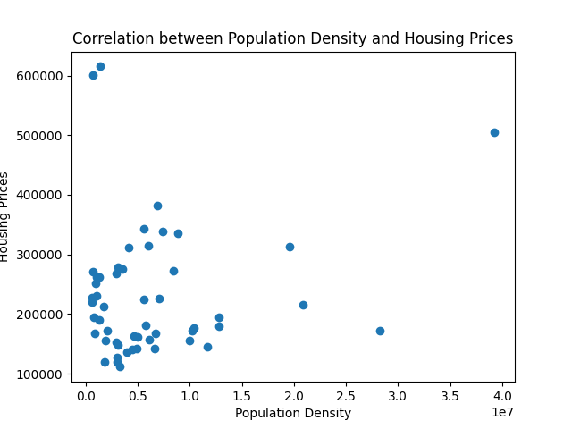

# 下载、分析和绘制美国人口普查数据

灵感来源于
[Ethan Mollick关于ChatGPT插件的近期博客文章](https://www.oneusefulthing.org/p/it-is-starting-to-get-strange)，
我使用`aider`和GPT-4对一些美国人口普查数据进行了数据分析。
我询问aider如何下载人口普查数据并建议一些待测试的假设。我请它编写代码获取数据，测试其中一个
假设，并提供结果的摘要和图表。

<div class="chat-transcript" markdown="1">

> $ aider  
> 使用git仓库: .git  

#### 有什么好的基础美国人口普查数据集可以用来分析有趣的模式？  

一个适合分析有趣模式的好的基础美国人口普查数据集是美国社区调查(American Community Survey, ACS)数据集。ACS是由美国人口普查局进行的持续调查，每年提供关于美国人口及其特征的重要信息。该数据集包含人口统计、社会、经济和住房特征等信息。

你可以在美国人口普查局的网站上找到ACS数据集：https://www.census.gov/programs-surveys/acs/data.html

在ACS数据集中可以分析的一些有趣模式包括：

1. 不同地区的人口增长和减少。
2. 种族和民族构成的变化。
3. 收入不平等和贫困水平。
4. 教育程度及其与收入的关系。
5. 住房可负担性和房屋所有权率。

记得参考数据集的文档和指南，以了解数据及其局限性。


</div>
<div class="chat-transcript" markdown="1">
#### 你知道如何下载美国社区调查数据吗？  

是的，我可以指导您如何下载美国社区调查(ACS)数据。您可以使用人口普查局的API来访问数据。为此，您需要一个API密钥，可以从人口普查局的网站获取。

以下是使用`requests`库下载ACS数据的Python示例：

1. 如果您尚未安装`requests`库，请先安装：

```
pip install requests
```

2. 使用以下代码下载ACS数据：

```python
import requests

# 将'your_api_key'替换为您的实际API密钥
api_key = 'your_api_key'

# 定义API端点和参数
url = 'https://api.census.gov/data/2019/acs/acs5'
params = {
    'get': 'NAME,B01001_001E',  # 要检索的变量（NAME: 地理区域名称，B01001_001E: 总人口）
    'for': 'state:*',  # 地理区域（所有州）
    'key': api_key
}

# 发送请求并解析响应
response = requests.get(url, params=params)
data = response.json()

# 打印数据
for row in data:
    print(row)
```

将`'your_api_key'`替换为您从人口普查局网站获取的API密钥。此示例检索所有州的总人口（变量`B01001_001E`）。您可以修改`get`和`for`参数以下载不同的变量和地理区域。

有关可用变量和地理区域的更多信息，请参考ACS文档：

- 变量：https://api.census.gov/data/2019/acs/acs5/variables.html
- 地理区域：https://api.census.gov/data/2019/acs/acs5/geography.html


</div>
<div class="chat-transcript" markdown="1">
#### 我如何获取API密钥？  

要从人口普查局获取API密钥，请按照以下步骤操作：

1. 访问人口普查局的API密钥请求页面：https://api.census.gov/data/key_signup.html

2. 填写表格，包括您的姓名、电子邮件地址、组织（如适用）以及您使用API的意图的简短描述。

3. 点击"Request Key"按钮。

4. 您将收到一封包含API密钥的电子邮件。电子邮件可能需要几分钟才能到达。如果您没有在收件箱中看到它，请务必检查您的垃圾邮件文件夹。

获得API密钥后，您可以在Python代码中使用它来访问美国社区调查数据，如前面示例所示。将`'your_api_key'`替换为您在电子邮件中收到的API密钥。


</div>
<div class="chat-transcript" markdown="1">
#### 请将您的下载脚本保存为`getdata.py`  

这是`getdata.py`文件，包含下载脚本：

```python
new_file/getdata.py
<<<<<<< ORIGINAL
=======
import requests

# Replace 'your_api_key' with your actual API key
api_key = 'your_api_key'

# Define the API endpoint and parameters
url = 'https://api.census.gov/data/2019/acs/acs5'
params = {
    'get': 'NAME,B01001_001E',  # Variables to retrieve (NAME: Geographic area name, B01001_001E: Total population)
    'for': 'state:*',  # Geographic area (all states)
    'key': api_key
}

# Send the request and parse the response
response = requests.get(url, params=params)
data = response.json()

# Print the data
for row in data:
    print(row)
>>>>>>> UPDATED
```

将此代码保存在名为`getdata.py`的新文件中。记得将`'your_api_key'`替换为您从人口普查局获取的实际API密钥。

> 允许创建新文件new_file/getdata.py？y  
> 将new_file/getdata.py添加到git？y  
> 已应用编辑到new_file/getdata.py  
> 提交afcb9d1 aider: 添加了`getdata.py`文件，包含下载脚本。  

</div>
<div class="chat-transcript" markdown="1">
#### 添加我的API密钥：4ae31ed2a0f0dd62609e51cd95deadbeefe7774f  

我将更新文件中的API密钥。

```python
new_file/getdata.py
<<<<<<< ORIGINAL
api_key = 'your_api_key'
=======
api_key = '4ae31ed2a0f0dd62609e51cd95deadbeefe7774f'
>>>>>>> UPDATED
```

> 已应用编辑到new_file/getdata.py  
> 提交1d8b4a6 aider: 在new_file/getdata.py中更新了API密钥。  


</div>
<div class="chat-transcript" markdown="1">
#### 使用ACS数据可以测试的一些有趣假设有哪些？  

以下是一些使用ACS（美国社区调查）数据可以测试的有趣假设：

1. 收入与教育水平的关系：更高的教育水平导致更高的收入。
2. 人口密度对住房价格的影响：人口密度较高的地区住房价格更高。
3. 就业率与犯罪率的关系：就业率较高导致犯罪率较低。
4. 公共交通可用性对汽车拥有率的影响：公共交通更好的地区汽车拥有率较低。
5. 年龄分布与医疗设施的关系：老年人口比例较高的地区拥有更多医疗设施。

这些只是一些例子。ACS数据提供了关于各种人口统计、社会、经济和住房特征的丰富信息，使您能够探索许多不同的假设。


</div>
<div class="chat-transcript" markdown="1">
#### 你能下载数据来测试假设#2吗？人口密度对住房价格的影响：人口密度较高的地区住房价格更高。  

作为AI语言模型，我不能直接下载或访问数据。但是，我可以帮助您编写代码，使用ACS数据测试假设#2。

要测试该假设，您需要获取人口密度和住房价格数据。您可以使用以下ACS变量：

- B01003_001E：总人口
- B25077_001E：自住房屋的中位数价值

以下是更新后的代码，用于获取所需数据：

```python
new_file/getdata.py
<<<<<<< ORIGINAL
    'get': 'NAME,B01001_001E',  # Variables to retrieve (NAME: Geographic area name, B01001_001E: Total population)
=======
    'get': 'NAME,B01003_001E,B25077_001E',  # Variables to retrieve (NAME: Geographic area name, B01003_001E: Total population, B25077_001E: Median value of owner-occupied housing units)
>>>>>>> UPDATED
```

运行更新后的代码后，您将获得每个地理区域的人口和住房价格数据。然后，您可以分析这些数据来测试假设。

> 已应用编辑到new_file/getdata.py  
> 提交81549ab aider: 更新代码以获取人口和住房价格数据，用于测试假设#2。  

</div>
<div class="chat-transcript" markdown="1">
#### 不要打印所有数据，而是打印一个摘要表，显示数据是否支持假设  

要打印摘要表，您可以使用pandas库分析数据并计算人口密度与住房价格之间的相关性。以下是如何修改代码：

1. 导入pandas。
2. 将JSON数据转换为pandas DataFrame。
3. 计算人口密度与住房价格之间的相关性。
4. 将相关性作为摘要表打印。

以下是对代码的更改：

```python
new_file/getdata.py
<<<<<<< ORIGINAL
import requests
=======
import requests
import pandas as pd
>>>>>>> UPDATED
```

```python
new_file/getdata.py
<<<<<<< ORIGINAL
data = response.json()
=======
data = response.json()
# Convert the JSON data to a pandas DataFrame
df = pd.DataFrame(data[1:], columns=data[0])
df[['B01003_001E', 'B25077_001E']] = df[['B01003_001E', 'B25077_001E']].apply(pd.to_numeric)
>>>>>>> UPDATED
```

```python
new_file/getdata.py
<<<<<<< ORIGINAL
for row in data:
    print(row)
=======
# Calculate the correlation between population density and housing prices
correlation = df['B01003_001E'].corr(df['B25077_001E'])

# Print the correlation as a summary table
print("Summary Table:")
print("Correlation between population density and housing prices:", correlation)
>>>>>>> UPDATED
```

应用这些更改后，代码将打印一个摘要表，显示人口密度与住房价格之间的相关性。正相关值表示人口密度较高的地区住房价格较高，支持假设。

> 已应用编辑到new_file/getdata.py  
> 已应用编辑到new_file/getdata.py  
> 已应用编辑到new_file/getdata.py  
> 提交2f4fcd4 aider: 添加了pandas库以分析数据并计算人口密度与住房价格之间的相关性，并将相关性作为摘要表打印。  


</div>
<div class="chat-transcript" markdown="1">
#### /run python3 new_file/getdata.py  
>```  
>Summary Table:  
>Correlation between population density and housing prices: 0.16020298445808737  
>```  
>  
> 将输出添加到聊天中？y

太好了！脚本似乎按预期工作。人口密度与住房价格之间的相关性为0.1602。如果您需要对代码进行任何进一步的帮助或修改，请告诉我。


</div>
<div class="chat-transcript" markdown="1">
#### 你能绘制一个显示相关性的图表吗？  

要绘制显示人口密度与住房价格之间相关性的图表，我们需要修改`new_file/getdata.py`文件。我们将使用`matplotlib`库来创建图表。如果您尚未安装，可以使用`pip install matplotlib`进行安装。

以下是需要进行的更改：

1. 导入`matplotlib.pyplot`模块。
2. 创建人口密度（x轴）和住房价格（y轴）的散点图。
3. 为坐标轴添加标签和图表标题。
4. 显示图表。

以下是更新后的代码：

```python
new_file/getdata.py
<<<<<<< ORIGINAL
import requests
import pandas as pd
=======
import requests
import pandas as pd
import matplotlib.pyplot as plt
>>>>>>> UPDATED

...

new_file/getdata.py
<<<<<<< ORIGINAL
print("Summary Table:")
print("Correlation between population density and housing prices:", correlation)
=======
print("Summary Table:")
print("Correlation between population density and housing prices:", correlation)

# Create a scatter plot of population density and housing prices
plt.scatter(df['B01003_001E'], df['B25077_001E'])
plt.xlabel('Population Density')
plt.ylabel('Housing Prices')
plt.title('Correlation between Population Density and Housing Prices')
plt.show()
>>>>>>> UPDATED
```

这将创建一个人口密度和住房价格的散点图，有助于可视化两个变量之间的相关性。

> 已应用编辑到new_file/getdata.py  
> 已应用编辑到new_file/getdata.py  
> 提交9ff3666 aider: 添加了人口密度和住房价格的散点图，以可视化相关性。  


</div>


